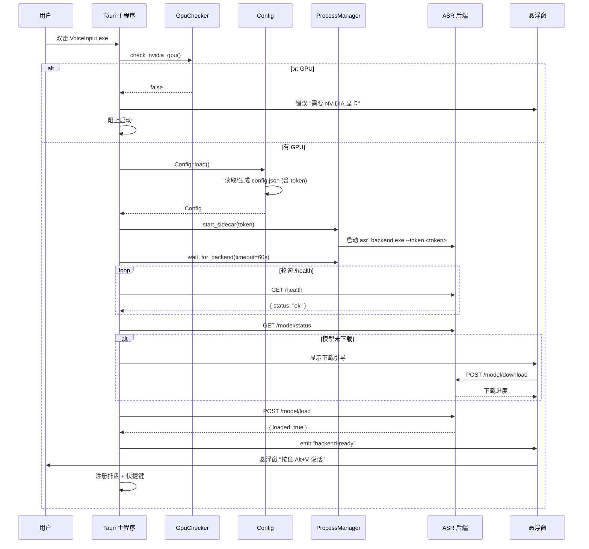
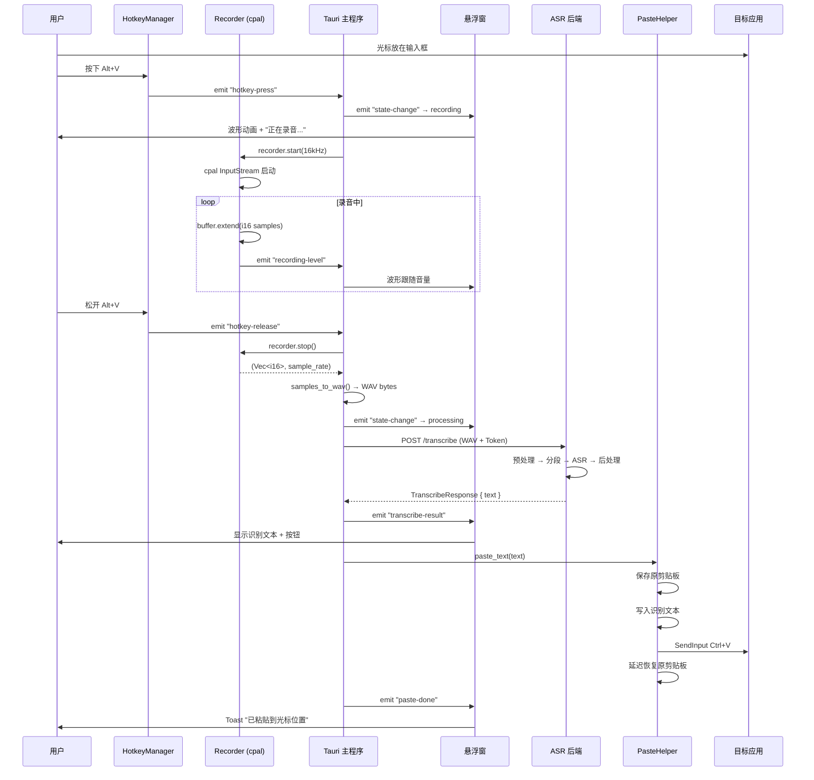
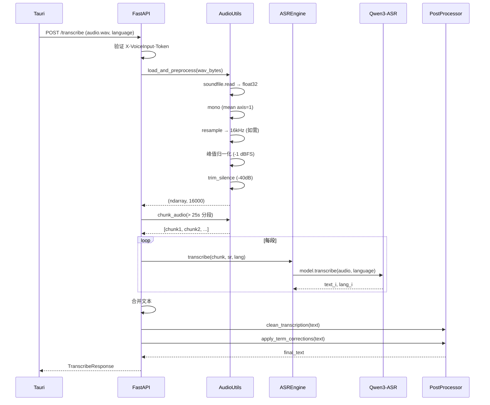
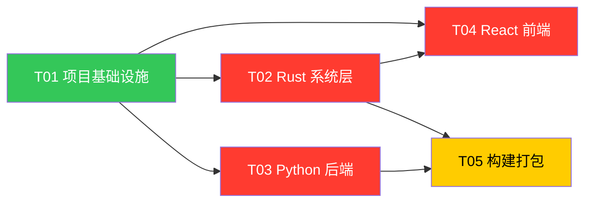

# VoiceInput v2 — 系统架构设计文档

> **版本**：v2.0  
> **日期**：2026-07-09  
> **作者**：高见远（架构师）  
> **项目名称**：voice_input_v2  
> **关联文档**：[PRD.md](./PRD.md) | [类图](./class-diagram.mermaid) | [时序图](./sequence-diagram.mermaid)

---

## 目录

1. [实现方案与框架选型](#1-实现方案与框架选型)
2. [文件列表及相对路径](#2-文件列表及相对路径)
3. [数据结构和接口](#3-数据结构和接口)
4. [程序调用流程](#4-程序调用流程)
5. [任务列表](#5-任务列表)
6. [依赖包列表](#6-依赖包列表)
7. [共享知识（跨文件约定）](#7-共享知识跨文件约定)
8. [待明确事项](#8-待明确事项)

---

## 1. 实现方案与框架选型

### 1.1 三层架构总览

VoiceInput v2 采用 **Tauri 2 外壳 + React 前端 + Python sidecar** 三层架构。各层职责明确，通过本地 HTTP + Tauri 事件系统通信。

```
┌─────────────────────────────────────────────────────────────────┐
│                    VoiceInput.exe (Tauri 2)                      │
│                                                                  │
│  ┌──────────────────────────────────────────────────────────┐   │
│  │              React 前端 (WebView2)                        │   │
│  │  悬浮窗 | 设置面板 | 模型下载引导 | 波形动画 | Toast       │   │
│  │  TypeScript + React 18 + Tailwind CSS                     │   │
│  └──────────────────────┬───────────────────────────────────┘   │
│                     Tauri IPC (invoke / emit)                    │
│  ┌──────────────────────▼───────────────────────────────────┐   │
│  │           Rust 系统控制层 (src-tauri/)                    │   │
│  │  全局快捷键(rdev) | 麦克风录音(cpal) | 剪贴板+粘贴        │   │
│  │  Sidecar进程管理 | 配置管理 | 系统托盘 | GPU检测          │   │
│  └──────────────────────┬───────────────────────────────────┘   │
└─────────────────────────┼───────────────────────────────────────┘
                          │ HTTP 127.0.0.1:8765
                          │ Header: X-VoiceInput-Token
┌─────────────────────────▼───────────────────────────────────────┐
│                   asr_backend.exe (Python Sidecar)               │
│                                                                  │
│  FastAPI Server (uvicorn)                                        │
│  ├─ /health          健康检查                                    │
│  ├─ /model/status    模型状态                                    │
│  ├─ /model/load      加载模型                                    │
│  ├─ /model/unload    释放显存                                    │
│  ├─ /model/download  下载模型 (断点续传)                         │
│  └─ /transcribe      语音识别 (核心)                             │
│                                                                  │
│  Qwen3-ASR-0.6B · CUDA · BF16 · SDPA                            │
└──────────────────────────────────────────────────────────────────┘
```

### 1.2 各层职责边界

| 层 | 技术 | 职责 | 不负责 |
|---|---|---|---|
| **React 前端** | TypeScript + React 18 + Tailwind | UI 渲染（悬浮窗/设置/下载引导）、状态展示、用户交互回调 | 系统级操作（录音/粘贴/快捷键） |
| **Rust 系统层** | Rust + Tauri 2 | 全局快捷键监听、cpal 麦克风录音、剪贴板写入 + SendInput 粘贴、Python sidecar 进程管理、配置读写、系统托盘、GPU 检测、token 管理 | ASR 推理、模型加载 |
| **Python Sidecar** | Python 3.11 + FastAPI + PyTorch | Qwen3-ASR 推理、音频预处理（归一化/去静音/重采样）、长音频分段、文本后处理（术语修正）、模型下载与生命周期管理 | UI 渲染、快捷键、粘贴、系统托盘 |

### 1.3 框架版本要求

| 组件 | 版本 | 说明 |
|---|---|---|
| Tauri | 2.x (latest stable) | 桌面应用框架，Rust 后端 |
| Rust | 1.75+ | 稳定版工具链 |
| React | 18.2+ | 前端 UI 框架 |
| TypeScript | 5.3+ | 类型安全 |
| Vite | 5.x | 前端构建工具 |
| Tailwind CSS | 3.4+ | 原子化 CSS |
| Python | 3.11.x | 后端运行时 |
| FastAPI | 0.110+ | HTTP API 框架 |
| uvicorn | 0.29+ | ASGI 服务器 |
| PyTorch | 2.2+ (CUDA 12.1) | 深度学习框架，GPU 推理 |
| qwen-asr | latest | Qwen3-ASR 官方推理包 |
| Node.js | 20 LTS | 前端构建环境 |

### 1.4 Tauri 插件选型

| 插件 | 用途 | 备注 |
|---|---|---|
| `tauri-plugin-shell` | Sidecar 进程管理 | 启动/停止 asr_backend.exe |
| `tauri-plugin-clipboard-manager` | 剪贴板读写 | 写入识别文本、保存/恢复原内容 |
| `tauri-plugin-store` | 持久化配置 | 配置文件读写（备选方案，也可直接用 Rust 文件 IO） |

> **注意**：全局快捷键不使用 `tauri-plugin-global-shortcut`，因为该插件仅响应快捷键按下事件（key-down），无法检测松开（key-up），而 P0 核心交互是"按住说话"（push-to-talk），需要 key-up 触发停止录音。详见 [1.5 节](#15-rust-录音-crate-选型cpal) 的 rdev 方案。

系统托盘使用 Tauri 2 内置的 `tauri::tray` 模块（Tauri 2 已将托盘功能内置，无需额外插件）。

### 1.5 Rust 录音 crate 选型（cpal）

**选型结论：`cpal`**

| 候选 | 优点 | 缺点 | 选择 |
|---|---|---|---|
| **cpal** | 纯 Rust、跨平台、WASAPI 后端、社区活跃、Tauri 生态常用 | API 略底层，需手动处理采样格式 | ✅ **首选** |
| portaudio-rs | 功能丰富 | 依赖 C 库，编译复杂 | ❌ |
| sounddevice-rs | API 友好 | 依赖 libsoundio，Windows 编译麻烦 | ❌ |

**cpal 选型理由：**
1. 纯 Rust 实现，无外部 C 依赖，交叉编译和打包简单
2. Windows 上使用 WASAPI 后端，与系统音频栈原生集成
3. 支持 `i16` 采样格式直接输出，无需格式转换
4. 在 Tauri 生态中广泛使用，文档和示例充足

### 1.6 全局快捷键方案（rdev）

**选型结论：`rdev` crate**

由于 P0 核心交互是"按住 Alt+V 说话，松开识别"，需要同时监听键盘按下（key-down）和松开（key-up）事件。Tauri 的 `global-shortcut` 插件仅支持 key-down 触发，无法满足 push-to-talk 需求。

`rdev` 提供跨平台的全局键盘事件监听，同时返回 `KeyPress` 和 `KeyRelease` 事件，是 pynput（原型中使用）的 Rust 等价方案。

**实现思路：**

```rust
// hotkey.rs — 核心逻辑伪代码
use rdev::{listen, Event, EventType, Key};
use std::sync::{Arc, Mutex, HashSet};
use std::thread;

pub fn start_hotkey_listener(
    app: AppHandle,
    hotkey_str: String,  // e.g. "alt+v"
) -> Result<JoinHandle, String> {
    let (modifiers, trigger) = parse_hotkey(&hotkey_str)?;
    let pressed_mods = Arc::new(Mutex::new(HashSet::<Key>::new()));
    let mods_clone = modifiers.clone();
    let trigger_clone = trigger;
    let app_clone = app.clone();

    let handle = thread::spawn(move || {
        listen(move |event: Event| {
            match event.event_type {
                EventType::KeyPress(key) => {
                    // 修饰键加入已按集合
                    if mods_clone.contains(&key) {
                        pressed_mods.lock().unwrap().insert(key);
                    }
                    // 检测 trigger + 全部修饰键同时按下
                    if key == trigger_clone
                        && pressed_mods.lock().unwrap().len() == mods_clone.len()
                    {
                        // 触发开始录音
                        let app = app_clone.clone();
                        app.emit("hotkey-press", ()).ok();
                    }
                }
                EventType::KeyRelease(key) => {
                    if key == trigger_clone {
                        // 触发停止录音
                        let app = app_clone.clone();
                        app.emit("hotkey-release", ()).ok();
                    }
                    if mods_clone.contains(&key) {
                        pressed_mods.lock().unwrap().remove(&key);
                    }
                }
                _ => {}
            }
        }).ok();
    });

    Ok(handle)
}

fn parse_hotkey(s: &str) -> Result<(Vec<Key>, Key), String> {
    // "alt+v" → ([Key::Alt], Key::KeyV)
    // "ctrl+shift+s" → ([Key::ControlLeft, Key::Shift], Key::KeyS)
    // ...
}
```

### 1.7 cpal 录音实现思路（详细）

**目标：采集 16kHz mono int16 音频数据，转换为 WAV，通过 HTTP 发送给 Python 后端。**

#### 数据流

```
cpal InputStream (i16 callback)
    → Vec<i16> buffer (Arc<Mutex>)
    → 同时计算 RMS level → emit("recording-level") → 前端波形动画
    → stop 时取出 buffer
    → AudioConverter::samples_to_wav() → Vec<u8> WAV bytes
    → reqwest POST /transcribe (multipart) → Python 后端
```

#### 采样率处理策略

Windows 音频设备在 WASAPI 共享模式下通常默认 44100Hz 或 48000Hz，不一定原生支持 16000Hz。策略如下：

1. **优先请求 16kHz**：查找设备支持的配置范围，若 16000Hz 在 `[min_sample_rate, max_sample_rate]` 区间内，直接使用
2. **回退到设备默认**：若设备不支持 16kHz，使用设备默认采样率录制，**记录实际采样率**，WAV 头中写入实际值
3. **后端重采样**：Python 后端 `load_and_preprocess()` 已包含 `scipy.resample_poly` 逻辑，会将任意采样率重采样到 16kHz

> **设计决策**：不在 Rust 层做重采样。原因：(1) 避免引入额外依赖（如 rubato）；(2) Python 后端已有成熟的重采样逻辑；(3) 录音通常不超过 120 秒，传输 48kHz WAV 的开销可接受。

#### 核心代码结构

```rust
// recorder.rs
use cpal::{
    Stream, StreamConfig, SampleRate, SampleFormat,
    traits::{DeviceTrait, HostTrait, StreamTrait},
};
use std::sync::{Arc, Mutex};
use tauri::{AppHandle, Emitter};

pub struct Recorder {
    stream: Option<Stream>,
    buffer: Arc<Mutex<Vec<i16>>>,
    is_recording: Arc<Mutex<bool>>,
    actual_sample_rate: u32,
}

impl Recorder {
    /// 启动录音
    pub fn start(
        &mut self,
        app: &AppHandle,
        device_index: Option<u32>,
        target_sr: u32,
    ) -> Result<u32, String> {
        let host = cpal::default_host();

        // 1. 选择设备
        let device = match device_index {
            Some(idx) => {
                let mut devices = host.input_devices()
                    .map_err(|e| e.to_string())?;
                devices.nth(idx as usize)
                    .ok_or("Device not found")?
            }
            None => host.default_input_device()
                .ok_or("No default input device")?,
        };

        // 2. 查找支持的配置 — 优先 16kHz mono i16
        let supported = device.supported_input_configs()
            .map_err(|e| e.to_string())?
            .filter(|c| c.sample_format() == SampleFormat::I16)
            .filter(|c| c.channels() == 1)
            .find(|c| {
                c.min_sample_rate().0 <= target_sr
                    && c.max_sample_rate().0 >= target_sr
            })
            .or_else(|| {
                // 回退：使用设备默认配置的第一个 i16 config
                device.supported_input_configs()
                    .ok()?
                    .find(|c| c.sample_format() == SampleFormat::I16)
            })
            .ok_or("No supported i16 config")?;

        let actual_sr = supported.min_sample_rate().0
            .max(target_sr)
            .min(supported.max_sample_rate().0);

        let config = StreamConfig {
            channels: 1,
            sample_rate: SampleRate(actual_sr),
            buffer_size: cpal::BufferSize::Default,
        };

        // 3. 清空缓冲区
        self.buffer.lock().unwrap().clear();
        *self.is_recording.lock().unwrap() = true;

        let buffer = self.buffer.clone();
        let is_recording = self.is_recording.clone();
        let app_clone = app.clone();

        // 4. 构建输入流
        let stream = device.build_input_stream(
            &config,
            move |data: &[i16], _: &cpal::InputCallbackInfo| {
                if !*is_recording.lock().unwrap() {
                    return;
                }
                // 追加采样数据到缓冲区
                buffer.lock().unwrap().extend_from_slice(data);

                // 计算 RMS 音量级别 (0.0 ~ 1.0)
                let rms = if data.is_empty() {
                    0.0
                } else {
                    let sum_sq: f64 = data.iter()
                        .map(|&s| (s as f64).powi(2))
                        .sum();
                    (sum_sq / data.len() as f64).sqrt()
                };
                let level = (rms / 32768.0).min(1.0) as f32;

                // 推送音量级别到前端
                let _ = app_clone.emit("recording-level", level);
            },
            |err| {
                eprintln!("cpal stream error: {}", err);
            },
            None, // buffer size: None = default
        ).map_err(|e| e.to_string())?;

        stream.play().map_err(|e| e.to_string())?;

        self.stream = Some(stream);
        self.actual_sample_rate = actual_sr;

        Ok(actual_sr)
    }

    /// 停止录音，返回 i16 采样数据和实际采样率
    pub fn stop(&mut self) -> Option<(Vec<i16>, u32)> {
        *self.is_recording.lock().unwrap() = false;

        // drop stream 停止采集
        self.stream.take();

        let buffer = self.buffer.lock().unwrap().clone();
        if buffer.is_empty() {
            return None;
        }

        Some((buffer, self.actual_sample_rate))
    }
}
```

#### WAV 转换

```rust
// audio.rs
pub fn samples_to_wav(samples: &[i16], sample_rate: u32, channels: u16) -> Vec<u8> {
    let num_channels = channels;
    let bits_per_sample: u16 = 16;
    let byte_rate = sample_rate * num_channels as u32 * (bits_per_sample / 8) as u32;
    let block_align = num_channels * (bits_per_sample / 8);
    let data_size = (samples.len() * 2) as u32;

    let mut wav = Vec::with_capacity(44 + data_size as usize);

    // RIFF header
    wav.extend_from_slice(b"RIFF");
    wav.extend_from_slice(&(36 + data_size).to_le_bytes());
    wav.extend_from_slice(b"WAVE");

    // fmt chunk
    wav.extend_from_slice(b"fmt ");
    wav.extend_from_slice(&16u32.to_le_bytes());
    wav.extend_from_slice(&1u16.to_le_bytes());        // PCM
    wav.extend_from_slice(&num_channels.to_le_bytes());
    wav.extend_from_slice(&sample_rate.to_le_bytes());
    wav.extend_from_slice(&byte_rate.to_le_bytes());
    wav.extend_from_slice(&block_align.to_le_bytes());
    wav.extend_from_slice(&bits_per_sample.to_le_bytes());

    // data chunk
    wav.extend_from_slice(b"data");
    wav.extend_from_slice(&data_size.to_le_bytes());

    // 采样数据 (little-endian i16)
    for &sample in samples {
        wav.extend_from_slice(&sample.to_le_bytes());
    }

    wav
}
```

#### HTTP 发送到后端

```rust
// commands.rs — Tauri command
#[tauri::command]
async fn stop_and_transcribe(
    state: State<'_, AppState>,
) -> Result<TranscribeResult, String> {
    // 1. 停止录音，获取数据
    let (samples, sr) = state.recorder.lock().unwrap()
        .stop()
        .ok_or("No audio captured")?;

    // 2. 转换为 WAV
    let wav_bytes = samples_to_wav(&samples, sr, 1);

    // 3. 发送到后端
    let client = reqwest::Client::new();
    let part = reqwest::multipart::Part::bytes(wav_bytes)
        .file_name("recording.wav")
        .mime_str("audio/wav")
        .map_err(|e| e.to_string())?;

    let form = reqwest::multipart::Form::new()
        .part("audio", part)
        .text("language", state.config.language.clone());

    let resp = client
        .post(format!("{}/transcribe", state.config.server_url))
        .header("X-VoiceInput-Token", &state.token)
        .multipart(form)
        .send()
        .await
        .map_err(|e| e.to_string())?;

    let result: TranscribeResponse = resp.json()
        .await
        .map_err(|e| e.to_string())?;

    // 4. 自动粘贴
    state.paste_helper.paste_text(
        &result.text,
        state.config.paste_delay_ms,
        state.config.clipboard_restore,
    );

    Ok(TranscribeResult {
        text: result.text,
        language: result.language,
        duration_ms: result.duration_ms,
        process_ms: result.process_ms,
    })
}
```

### 1.8 自动粘贴方案（SendInput）

使用 Windows `SendInput` API 模拟 `Ctrl+V` 按键，配合 `tauri-plugin-clipboard-manager` 写入剪贴板。

```rust
// paste.rs
use windows::Win32::UI::Input::KeyboardAndMouse::{
    SendInput, INPUT, INPUT_KEYBOARD, KEYBDINPUT, KEYEVENTF_KEYUP,
    VK_CONTROL, VK_V,
};

pub fn simulate_ctrl_v() -> Result<(), String> {
    let mut inputs = [
        INPUT {
            r#type: INPUT_KEYBOARD,
            Anonymous: INPUT_0 { ki: KEYBDINPUT {
                wVk: VK_CONTROL, wScan: 0,
                dwFlags: Default::default(),
                time: 0, dwExtraInfo: 0,
            }},
        },
        INPUT {
            r#type: INPUT_KEYBOARD,
            Anonymous: INPUT_0 { ki: KEYBDINPUT {
                wVk: VK_V, wScan: 0,
                dwFlags: Default::default(),
                time: 0, dwExtraInfo: 0,
            }},
        },
        INPUT {
            r#type: INPUT_KEYBOARD,
            Anonymous: INPUT_0 { ki: KEYBDINPUT {
                wVk: VK_V, wScan: 0,
                dwFlags: KEYEVENTF_KEYUP,
                time: 0, dwExtraInfo: 0,
            }},
        },
        INPUT {
            r#type: INPUT_KEYBOARD,
            Anonymous: INPUT_0 { ki: KEYBDINPUT {
                wVk: VK_CONTROL, wScan: 0,
                dwFlags: KEYEVENTF_KEYUP,
                time: 0, dwExtraInfo: 0,
            }},
        },
    ];

    unsafe {
        SendInput(&inputs, std::mem::size_of::<INPUT>() as i32)
            .map_err(|e| format!("SendInput failed: {:?}", e))?;
    }
    Ok(())
}
```

**完整粘贴流程：**
1. 保存原剪贴板内容（`clipboard_manager.read_text()`）
2. 写入识别文本（`clipboard_manager.write_text(text)`）
3. 延迟 `paste_delay_ms`（默认 800ms，确保剪贴板写入完成）
4. 模拟 `Ctrl+V`（`SendInput`）
5. 延迟 800ms（确保粘贴动作完成）
6. 恢复原剪贴板内容（`clipboard_manager.write_text(old)`）

---

## 2. 文件列表及相对路径

以下所有路径相对于项目根目录 `voice-input-v2/`。

### 2.1 项目根目录配置文件

```
voice-input-v2/
├── package.json                    # npm 依赖声明 + 构建脚本
├── vite.config.ts                  # Vite 构建配置
├── tsconfig.json                   # TypeScript 编译配置
├── tsconfig.node.json              # Node 环境 TS 配置 (vite.config 用)
├── tailwind.config.ts              # Tailwind CSS 配置
├── postcss.config.js               # PostCSS 配置 (Tailwind 需要)
├── index.html                      # Vite 入口 HTML
├── .gitignore
└── README.md
```

### 2.2 Rust 层 (`src-tauri/`)

```
src-tauri/
├── Cargo.toml                      # Rust 依赖声明
├── build.rs                        # Tauri 构建脚本
├── tauri.conf.json                 # Tauri 应用配置 (窗口/sidecar/图标/权限)
├── icons/                          # 应用图标
│   ├── icon.ico
│   ├── icon.png
│   └── icon.icns
├── capabilities/                   # Tauri 2 权限声明
│   └── default.json
├── binaries/                       # Sidecar 二进制 (构建时放入)
│   └── asr_backend-x86_64-pc-windows-msvc.exe
└── src/
    ├── main.rs                     # 入口: 应用初始化、状态注册、命令注册
    ├── lib.rs                      # 库入口 (Tauri 2 推荐: lib.rs + main.rs 分离)
    ├── app_state.rs                # AppState 全局状态结构
    ├── config.rs                   # 配置读写 + token 生成
    ├── recorder.rs                 # cpal 麦克风录音
    ├── audio.rs                    # i16 → WAV 转换 + 音量计算
    ├── hotkey.rs                   # rdev 全局快捷键 (push-to-talk)
    ├── paste.rs                    # 剪贴板写入 + SendInput 模拟粘贴
    ├── process_manager.rs          # Python sidecar 进程管理
    ├── tray.rs                     # 系统托盘
    ├── gpu_check.rs                # NVIDIA GPU 检测
    ├── commands.rs                 # Tauri commands (前端可调用的 Rust 函数)
    └── models.rs                   # Rust ↔ JSON 序列化模型
```

### 2.3 React 前端 (`src/`)

```
src/
├── main.tsx                        # React 入口
├── App.tsx                         # 根组件 (路由: 悬浮窗/设置/下载)
├── index.css                       # 全局样式 (Tailwind directives)
├── types/
│   └── index.ts                    # TypeScript 类型定义
├── components/
│   ├── FloatingWindow.tsx          # 悬浮录音窗 (核心 UI)
│   ├── WaveformBars.tsx            # 9 根柱状波形动画
│   ├── Toast.tsx                   # Toast 通知组件
│   ├── SettingsPanel.tsx           # 设置面板 (4 Tab)
│   ├── ModelDownload.tsx           # 首次运行模型下载引导
│   ├── HotkeyCapture.tsx           # 快捷键捕获组件 (设置面板用)
│   └── ErrorBoundary.tsx           # 错误边界
├── hooks/
│   ├── useRecording.ts             # 录音状态管理 (监听 Tauri 事件)
│   ├── useBackend.ts               # 后端 API 通信
│   └── useConfig.ts                # 配置管理
├── utils/
│   ├── api.ts                      # Tauri invoke 封装
│   ├── constants.ts                # 常量 (颜色/默认值/状态枚举)
│   └── format.ts                   # 格式化工具 (时间/文件大小)
└── styles/
    └── floating-window.css         # 悬浮窗专用样式 (Tailwind 难以覆盖的部分)
```

### 2.4 Python 后端 (`backend/`)

```
backend/
├── server.py                       # FastAPI 应用入口 + API 端点
├── asr_engine.py                   # Qwen3-ASR 模型封装
├── audio_utils.py                  # 音频预处理 (归一化/去静音/重采样/分段)
├── model_manager.py                # 模型下载与路径管理
├── postprocess.py                  # 文本后处理 (术语修正/清理)
├── config.py                       # 后端配置常量
├── requirements.txt                # Python 依赖
└── build_backend.py                # PyInstaller 打包脚本
```

### 2.5 构建脚本与安装包 (`scripts/`, `installer/`)

```
scripts/
├── build_backend.ps1               # PyInstaller 打包 Python 后端为 exe
├── build_frontend.ps1              # 前端构建 + Tauri 编译
├── build_installer.ps1             # 完整构建流水线 (一键构建)
└── download_model.py               # 开发用模型下载脚本

installer/
├── installer.nsi                   # NSIS 安装包脚本
└── license.txt                     # 许可证文件

resources/
├── icon.ico                        # 应用图标
└── default_config.json             # 默认配置模板
```

### 2.6 完整目录树

```
voice-input-v2/
├── package.json
├── vite.config.ts
├── tsconfig.json
├── tsconfig.node.json
├── tailwind.config.ts
├── postcss.config.js
├── index.html
├── .gitignore
├── README.md
│
├── src-tauri/
│   ├── Cargo.toml
│   ├── build.rs
│   ├── tauri.conf.json
│   ├── icons/
│   │   ├── icon.ico
│   │   ├── icon.png
│   │   └── icon.icns
│   ├── capabilities/
│   │   └── default.json
│   ├── binaries/
│   │   └── asr_backend-x86_64-pc-windows-msvc.exe
│   └── src/
│       ├── main.rs
│       ├── lib.rs
│       ├── app_state.rs
│       ├── config.rs
│       ├── recorder.rs
│       ├── audio.rs
│       ├── hotkey.rs
│       ├── paste.rs
│       ├── process_manager.rs
│       ├── tray.rs
│       ├── gpu_check.rs
│       ├── commands.rs
│       └── models.rs
│
├── src/
│   ├── main.tsx
│   ├── App.tsx
│   ├── index.css
│   ├── types/
│   │   └── index.ts
│   ├── components/
│   │   ├── FloatingWindow.tsx
│   │   ├── WaveformBars.tsx
│   │   ├── Toast.tsx
│   │   ├── SettingsPanel.tsx
│   │   ├── ModelDownload.tsx
│   │   ├── HotkeyCapture.tsx
│   │   └── ErrorBoundary.tsx
│   ├── hooks/
│   │   ├── useRecording.ts
│   │   ├── useBackend.ts
│   │   └── useConfig.ts
│   ├── utils/
│   │   ├── api.ts
│   │   ├── constants.ts
│   │   └── format.ts
│   └── styles/
│       └── floating-window.css
│
├── backend/
│   ├── server.py
│   ├── asr_engine.py
│   ├── audio_utils.py
│   ├── model_manager.py
│   ├── postprocess.py
│   ├── config.py
│   ├── requirements.txt
│   └── build_backend.py
│
├── scripts/
│   ├── build_backend.ps1
│   ├── build_frontend.ps1
│   ├── build_installer.ps1
│   └── download_model.py
│
├── installer/
│   ├── installer.nsi
│   └── license.txt
│
├── resources/
│   ├── icon.ico
│   └── default_config.json
│
└── docs/
    ├── PRD.md
    ├── ARCHITECTURE.md            ← 本文档
    ├── class-diagram.mermaid
    └── sequence-diagram.mermaid
```

---

## 3. 数据结构和接口

> 完整类图见 [class-diagram.mermaid](./class-diagram.mermaid)

### 3.1 Rust 层核心数据结构

#### AppState — 全局应用状态

```rust
// app_state.rs
use std::sync::Mutex;
use tauri::AppHandle;

pub struct AppState {
    pub config: Mutex<Config>,
    pub recorder: Mutex<Recorder>,
    pub recording_state: Mutex<RecordingState>,
    pub sidecar_child: Mutex<Option<tauri_plugin_shell::process::CommandChild>>,
    pub token: String,
    pub backend_ready: Mutex<bool>,
    pub app_handle: AppHandle,
}
```

#### Config — 用户配置

```rust
// config.rs
use serde::{Deserialize, Serialize};

#[derive(Debug, Clone, Serialize, Deserialize)]
pub struct Config {
    pub token: String,                    // 本地安全 token
    pub server_url: String,               // "http://127.0.0.1:8765"
    pub hotkey: String,                   // "alt+v"
    pub language_hotkey: String,          // "alt+l"
    pub language: String,                 // "auto" | "Chinese" | "English"
    pub sample_rate: u32,                 // 16000
    pub channels: u16,                    // 1
    pub paste_delay_ms: u32,             // 800
    pub clipboard_restore: bool,          // true
    pub input_device: Option<u32>,        // None = 系统默认
    pub normalize_audio: bool,            // true
    pub trim_silence: bool,               // true
    pub silence_threshold_db: f32,        // -40.0
    pub max_record_sec: u32,              // 120
    pub request_timeout_sec: u32,         // 120
    pub model_path: Option<String>,       // None = 默认 AppData 路径
    pub model_strategy: String,           // "balanced" | "performance" | "memory_saver"
}
```

#### RecordingState — 录音状态

```rust
// app_state.rs
use std::time::Instant;

#[derive(Debug, Clone)]
pub struct RecordingState {
    pub is_recording: bool,
    pub actual_sample_rate: u32,
    pub start_time: Option<Instant>,
    pub max_level: i16,
}
```

#### TranscribeResponse — 识别结果（Rust 端反序列化）

```rust
// models.rs
use serde::{Deserialize, Serialize};

#[derive(Debug, Clone, Serialize, Deserialize)]
pub struct TranscribeResponse {
    pub text: String,
    pub language: Option<String>,
    pub duration_ms: f64,
    pub process_ms: f64,
    pub chunks: u32,
}
```

### 3.2 React 层核心类型

```typescript
// src/types/index.ts

/** 应用状态枚举 */
type AppStatus =
  | 'idle'          // 空闲
  | 'recording'     // 录音中
  | 'processing'    // 识别中
  | 'result'        // 结果展示
  | 'error'         // 错误
  | 'starting'      // 后端启动中
  | 'loading_model' // 模型加载中
  | 'downloading'   // 模型下载中

/** 语言选项 */
type Language = 'auto' | 'Chinese' | 'English'

/** 用户配置 */
interface UserConfig {
  token: string
  server_url: string
  hotkey: string
  language_hotkey: string
  language: Language
  sample_rate: number
  channels: number
  paste_delay_ms: number
  clipboard_restore: boolean
  input_device: number | null
  normalize_audio: boolean
  trim_silence: boolean
  silence_threshold_db: number
  max_record_sec: number
  request_timeout_sec: number
  model_path: string | null
  model_strategy: 'balanced' | 'performance' | 'memory_saver'
}

/** 悬浮窗状态 */
interface FloatingWindowState {
  status: AppStatus
  resultText: string
  volumeLevel: number        // 0.0 ~ 1.0
  language: Language
  isExpanded: boolean
  toastMessage: string
  recordingDuration: number  // 秒
  errorMessage: string
}

/** 识别结果 */
interface TranscribeResult {
  text: string
  language: string | null
  duration_ms: number
  process_ms: number
  chunks: number
}

/** 音频设备 */
interface AudioDevice {
  index: number
  name: string
  channels: number
  is_default: boolean
}

/** 模型状态 */
type ModelStatus =
  | 'not_downloaded'
  | 'downloaded'
  | 'loading'
  | 'ready'
  | 'busy'
  | 'error'

/** 下载状态 */
type DownloadStatus =
  | 'idle'
  | 'downloading'
  | 'paused'
  | 'completed'
  | 'failed'

/** 模型下载进度 */
interface DownloadProgress {
  progress: number          // 0 ~ 100
  downloaded_bytes: number
  total_bytes: number
  speed: number             // bytes/s
  eta: number               // seconds
}
```

### 3.3 Python 层核心数据结构

```python
# backend/server.py
from pydantic import BaseModel
from typing import Optional

class TranscribeResponse(BaseModel):
    text: str
    language: Optional[str] = None
    duration_ms: float = 0
    process_ms: float = 0
    chunks: int = 1

class ModelLoadRequest(BaseModel):
    model_name: Optional[str] = None

class HealthResponse(BaseModel):
    status: str
    model: str
    device: str
    model_loaded: bool
    gpu_available: bool
    max_new_tokens: int

class DownloadRequest(BaseModel):
    source: str  # "modelscope" | "huggingface" | "local"
    local_path: Optional[str] = None
```

```python
# backend/config.py
from pathlib import Path
import os

HOST = "127.0.0.1"
PORT = 8765
MODEL_NAME = os.environ.get("ASR_MODEL", "Qwen/Qwen3-ASR-0.6B")
DEVICE = os.environ.get("ASR_DEVICE", "cuda:0")
MAX_NEW_TOKENS = 1024
CHUNK_THRESHOLD_SEC = 25.0
CHUNK_OVERLAP_SEC = 1.0
SILENCE_THRESHOLD_DB = -40

# 运行时由启动参数注入
LOCAL_TOKEN = os.environ.get("VOICEINPUT_TOKEN", "")

# 模型存储目录
MODEL_BASE_DIR = Path(os.environ.get(
    "VOICEINPUT_MODEL_DIR",
    str(Path.home() / "AppData" / "Local" / "VoiceInput" / "models")
))
```

### 3.4 API 接口定义

| 端点 | 方法 | 请求 | 响应 | Token | 说明 |
|---|---|---|---|---|---|
| `/health` | GET | — | `HealthResponse` | ❌ | 健康检查（Tauri 轮询用） |
| `/model/status` | GET | — | `{ loaded: bool, state: str }` | ✅ | 查询模型状态 |
| `/model/load` | POST | `ModelLoadRequest` | `{ status, loaded }` | ✅ | 加载模型到 GPU |
| `/model/unload` | POST | — | `{ status, loaded }` | ✅ | 释放 GPU 显存 |
| `/model/download` | POST | `DownloadRequest` | `{ status, progress }` | ✅ | 下载模型 |
| `/transcribe` | POST | `multipart: audio + language` | `TranscribeResponse` | ✅ | 语音识别 |

**Token 约定**：所有需要 Token 的接口必须在 HTTP Header 中携带 `X-VoiceInput-Token: <token>`，后端验证不通过返回 `403`。

---

## 4. 程序调用流程

> 完整时序图见 [sequence-diagram.mermaid](./sequence-diagram.mermaid)

### 4.1 主程序启动流程



### 4.2 录音识别完整流程



### 4.3 后端 ASR 推理流程



---

## 5. 任务列表

### 任务概览

| 任务 | 标题 | 优先级 | 依赖 | 复杂度 |
|---|---|---|---|---|
| T01 | 项目基础设施搭建 | P0 | — | 简单 |
| T02 | Rust 系统控制层 | P0 | T01 | 复杂 |
| T03 | Python ASR 后端 | P0 | T01 | 复杂 |
| T04 | React 前端 UI | P0+P1 | T01, T02 | 复杂 |
| T05 | 构建打包与安装程序 | P0 | T01, T02, T03 | 中等 |

### 依赖关系图



---

### T01: 项目基础设施搭建

| 项 | 内容 |
|---|---|
| **优先级** | P0 |
| **依赖** | 无 |
| **复杂度** | 简单 |
| **实现顺序** | 第 1 步，所有后续任务的基础 |

**目标**：搭建完整的项目骨架，使 `npm run tauri dev` 可以启动一个空白 Tauri 2 + React 应用。

**涉及文件**（16 个）：

```
package.json                        # npm 依赖 + scripts
vite.config.ts                      # Vite 配置 (React 插件 + Tauri 集成)
tsconfig.json                       # TS 编译配置
tsconfig.node.json                  # Node TS 配置
tailwind.config.ts                  # Tailwind 配置
postcss.config.js                   # PostCSS 配置
index.html                          # HTML 入口
src/main.tsx                        # React 入口 (ReactDOM.createRoot)
src/App.tsx                         # 根组件 (空白骨架)
src/index.css                       # Tailwind directives
src-tauri/Cargo.toml                # Rust 依赖声明
src-tauri/build.rs                  # Tauri build script
src-tauri/tauri.conf.json           # Tauri 应用配置 (窗口/图标/sidecar/权限)
src-tauri/src/main.rs               # Rust 入点 (最小骨架, 仅启动 Tauri)
src-tauri/src/lib.rs                # 库入口 (Tauri 2 推荐)
src-tauri/capabilities/default.json # Tauri 2 权限声明
backend/requirements.txt            # Python 依赖声明
resources/default_config.json       # 默认配置模板
```

**验收标准**：
- [x] `npm install` 成功
- [x] `npm run tauri dev` 启动空白窗口
- [x] `cargo build` 在 `src-tauri/` 下成功
- [x] Tailwind CSS 生效（可用 `className="text-red-500"` 验证）
- [x] `tauri.conf.json` 已配置 sidecar（`externalBin: ["binaries/asr_backend"]`）

---

### T02: Rust 系统控制层

| 项 | 内容 |
|---|---|
| **优先级** | P0 |
| **依赖** | T01 |
| **复杂度** | 复杂 |
| **实现顺序** | 第 2 步，与 T03 可并行 |

**目标**：实现全部 Rust 系统级功能：GPU 检测、配置管理（含 token）、cpal 录音、rdev 快捷键、剪贴板+粘贴、Sidecar 进程管理、系统托盘、Tauri commands。

**涉及文件**（12 个）：

```
src-tauri/src/main.rs               # 填充完整入口逻辑 (启动流程编排)
src-tauri/src/app_state.rs          # AppState 全局状态
src-tauri/src/config.rs             # 配置读写 + token 生成 + 路径管理
src-tauri/src/recorder.rs           # cpal 录音 (start/stop/level)
src-tauri/src/audio.rs              # i16→WAV 转换 + RMS 计算
src-tauri/src/hotkey.rs             # rdev 全局快捷键 (push-to-talk)
src-tauri/src/paste.rs              # 剪贴板 + SendInput 粘贴 + 恢复
src-tauri/src/process_manager.rs    # Sidecar 启动/停止/健康检查
src-tauri/src/tray.rs               # 系统托盘 + 右键菜单
src-tauri/src/gpu_check.rs          # NVIDIA GPU 检测 (nvidia-smi / NVML)
src-tauri/src/commands.rs           # Tauri commands (前端可调用的接口)
src-tauri/src/models.rs             # 序列化模型 (TranscribeResponse 等)
```

**对应 PRD 需求**：

| PRD 编号 | 需求 | 本任务覆盖 |
|---|---|---|
| P0-02 | 全局快捷键录音 | `hotkey.rs` (rdev, Alt+V, push-to-talk) |
| P0-03 | 麦克风录音 | `recorder.rs` (cpal, 16kHz mono i16) |
| P0-05 | 自动粘贴到光标位置 | `paste.rs` (clipboard + SendInput) |
| P0-07 | 后端 sidecar 自动管理 | `process_manager.rs` (start/stop/restart) |
| P0-08 | 首次运行模型下载 | `commands.rs` + `process_manager.rs` (触发后端下载) |
| Q4 决策 | GPU 检测阻止启动 | `gpu_check.rs` |
| Q6 决策 | 本地 token | `config.rs` (首次生成 UUID, 持久化) |
| Q8 决策 | Rust 录音 | `recorder.rs` (cpal) |
| P1-02 | 系统托盘常驻 | `tray.rs` |
| P1-08 | 剪贴板恢复 | `paste.rs` |

**关键实现要点**：

1. **`gpu_check.rs`**：使用 `std::process::Command` 调用 `nvidia-smi`，或使用 `nvml-wrapper` crate 检测。无 GPU 时通过 Tauri 事件通知前端显示错误界面，并阻止后续启动流程。

2. **`config.rs`**：
   - 配置文件路径：`%LOCALAPPDATA%\VoiceInput\config.json`
   - 首次运行：生成 `uuid::Uuid::new_v4()` 作为 token，写入配置
   - 提供 `load()` / `save()` / `generate_token()` 方法

3. **`recorder.rs`**：详见 [1.7 节](#17-cpal-录音实现思路详细) 的完整实现思路。核心是 cpal `build_input_stream` + `Arc<Mutex<Vec<i16>>>` 缓冲 + 数据回调中计算 RMS 并 emit 到前端。

4. **`hotkey.rs`**：详见 [1.6 节](#16-全局快捷键方案rdev) 的实现思路。rdev `listen` 在独立线程中运行，检测 modifier + trigger 组合，通过 `app.emit()` 通知主线程。

5. **`paste.rs`**：使用 `tauri-plugin-clipboard-manager` 读写剪贴板，使用 `windows` crate 的 `SendInput` 模拟 Ctrl+V。粘贴后延迟恢复原剪贴板内容。

6. **`process_manager.rs`**：
   - 使用 `tauri-plugin-shell` 的 `app.shell().sidecar("asr_backend")` 启动 sidecar
   - 启动参数：`--token <token> --port 8765`
   - 轮询 `GET /health` 直到成功或超时（60s）
   - 监控 sidecar 进程，崩溃时自动重启

7. **`tray.rs`**：使用 Tauri 2 内置 `tauri::tray::TrayIconBuilder`。右键菜单包含：显示面板、设置、语言切换（Auto/CN/EN）、预加载模型、释放显存、退出。

8. **`commands.rs`**：暴露给前端的 Tauri commands：
   - `start_recording()` — 开始录音
   - `stop_and_transcribe()` — 停止录音并发送后端识别
   - `get_config()` / `save_config(cfg)` — 读写配置
   - `get_devices()` — 获取音频输入设备列表
   - `check_backend_status()` — 检查后端和模型状态
   - `open_settings()` — 打开设置窗口
   - `download_model(source)` — 触发模型下载
   - `load_model()` / `unload_model()` — 模型生命周期管理

**验收标准**：
- [x] `cargo build` 成功，无编译错误
- [x] 程序启动时检测 GPU，无 GPU 显示错误
- [x] 首次运行生成 token 并保存到 config.json
- [x] 按 Alt+V 开始录音，松开后停止
- [x] 录音时前端能收到 `recording-level` 事件
- [x] Sidecar 能自动启动，`/health` 可达
- [x] 识别结果能自动粘贴到记事本
- [x] 系统托盘显示，右键菜单可用

---

### T03: Python ASR 后端

| 项 | 内容 |
|---|---|
| **优先级** | P0 |
| **依赖** | T01 |
| **复杂度** | 复杂 |
| **实现顺序** | 第 2 步，与 T02 可并行 |

**目标**：实现完整的 Python ASR 后端，包括 FastAPI 服务、Qwen3-ASR 推理、音频预处理、长音频分段、文本后处理、模型下载管理。

**涉及文件**（7 个）：

```
backend/server.py                   # FastAPI 应用 + 全部 API 端点
backend/asr_engine.py               # Qwen3-ASR 模型封装 (load/unload/transcribe)
backend/audio_utils.py              # 音频预处理 (归一化/去静音/重采样/分段)
backend/model_manager.py            # 模型下载 (ModelScope/HF) + 路径管理
backend/postprocess.py              # 文本后处理 (术语修正/清理)
backend/config.py                   # 后端配置常量 + 环境变量读取
backend/build_backend.py            # PyInstaller 打包脚本 (生成 asr_backend.exe)
```

**对应 PRD 需求**：

| PRD 编号 | 需求 | 本任务覆盖 |
|---|---|---|
| P0-04 | 本地语音识别 | `asr_engine.py` + `server.py` (/transcribe) |
| P0-07 | 后端 sidecar | `server.py` (FastAPI + 127.0.0.1:8765 + token) |
| P0-08 | 首次运行模型下载 | `model_manager.py` (ModelScope 断点续传) |
| P1-03 | 术语修正词典 | `postprocess.py` (TERM_CORRECTIONS) |
| P1-04 | 音频预处理 | `audio_utils.py` (归一化 + 去静音) |
| P1-05 | 长音频分段 | `audio_utils.py` (chunk_audio) |
| P1-06 | 模型生命周期管理 | `asr_engine.py` (load/unload) + `server.py` (/model/*) |
| Q3 决策 | 模型断点续传 | `model_manager.py` (SDK 原生能力) |
| Q4 决策 | 只支持 GPU | `asr_engine.py` (device=cuda, 检测 torch.cuda.is_available) |
| Q6 决策 | 本地 token | `server.py` (X-VoiceInput-Token 验证中间件) |

**关键实现要点**：

1. **`server.py`**：
   - 基于已有原型 `voice-input/backend/server.py` 重构
   - 端口改为 8765（v2 规范）
   - 启动参数接收 token：`python server.py --token <token> --port 8765`
   - 所有敏感端点加 `X-VoiceInput-Token` header 验证
   - 新增 `/model/download` 端点（调用 `model_manager`）
   - 新增 `/model/status` 端点（返回模型状态：not_downloaded/downloaded/loading/ready/busy/error）
   - GPU 检测：启动时检查 `torch.cuda.is_available()`，无 GPU 则 `/health` 返回 `gpu_available: false`

2. **`asr_engine.py`**：
   - 基于已有原型的 `QwenASREngine` 类
   - 使用 `torch.bfloat16`（原型已验证可行）
   - `max_new_tokens=1024`（原型已增大）
   - 懒加载：首次 transcribe 时自动 load（平衡模式）
   - 支持 unload 释放显存（`torch.cuda.empty_cache()`）

3. **`audio_utils.py`**：
   - 直接复用原型中已验证的实现：
     - `load_and_preprocess()`：soundfile 读取 → mono → 重采样 16kHz → 峰值归一化 → 去静音
     - `trim_silence()`：RMS 帧检测，阈值可配
     - `find_split_points()`：静音位置检测
     - `chunk_audio()`：> 25s 在静音处分段

4. **`model_manager.py`**：
   - `check_model_exists()`：检查 `AppData/Local/VoiceInput/models/Qwen3-ASR-0.6B/` 是否存在
   - `download_from_modelscope()`：使用 `modelscope.snapshot_download()` 原生断点续传
   - `download_from_huggingface()`：使用 `huggingface_hub.snapshot_download()` 原生断点续传
   - 下载进度通过 `/model/download` 端点的 SSE (Server-Sent Events) 推送给前端

5. **`postprocess.py`**：
   - 直接复用原型的 `TERM_CORRECTIONS` 词典和 `clean_transcription()` 函数
   - 词典可从外部 JSON 文件加载（支持用户自定义术语）

6. **`build_backend.py`**：
   - PyInstaller 打包脚本，将 `server.py` + 依赖打包为 `asr_backend.exe`
   - `--onedir` 模式（不是 `--onefile`，避免启动慢）
   - 包含 PyTorch CUDA 库
   - 输出到 `src-tauri/binaries/asr_backend-x86_64-pc-windows-msvc.exe`

**验收标准**：
- [x] `pip install -r requirements.txt` 成功
- [x] `python server.py --token test123 --port 8765` 启动成功
- [x] `GET /health` 返回 `{ status: "ok", gpu_available: true }`
- [x] `POST /transcribe` 上传 WAV 返回识别文本
- [x] 无 token 请求返回 403
- [x] 无 GPU 时 `/health` 返回 `gpu_available: false`
- [x] 长音频（> 25s）自动分段识别
- [x] 术语修正生效（"派森" → "Python"）
- [x] `python build_backend.py` 生成 `asr_backend.exe`

---

### T04: React 前端 UI

| 项 | 内容 |
|---|---|
| **优先级** | P0 + P1 |
| **依赖** | T01, T02 |
| **复杂度** | 复杂 |
| **实现顺序** | 第 3 步，在 T02 提供的 Tauri commands 基础上开发 |

**目标**：实现全部前端 UI，包括豆包风格悬浮窗（波形动画/状态/结果/按钮）、设置面板（4 Tab）、模型下载引导界面。

**涉及文件**（14 个）：

```
src/App.tsx                         # 根组件 (窗口路由: floating/settings/download)
src/types/index.ts                  # TypeScript 类型定义
src/components/FloatingWindow.tsx   # 悬浮录音窗 (核心 UI)
src/components/WaveformBars.tsx     # 9 根柱状波形动画
src/components/Toast.tsx            # Toast 通知
src/components/SettingsPanel.tsx    # 设置面板 (4 Tab: 麦克风/快捷键/音频/高级)
src/components/ModelDownload.tsx    # 首次运行模型下载引导
src/components/HotkeyCapture.tsx    # 快捷键捕获组件 (设置面板用)
src/components/ErrorBoundary.tsx    # 错误边界
src/hooks/useRecording.ts           # 录音状态 (监听 Tauri 事件 + 状态机)
src/hooks/useBackend.ts             # 后端 API 通信
src/hooks/useConfig.ts              # 配置管理
src/utils/api.ts                    # Tauri invoke 封装
src/utils/constants.ts              # 常量 (颜色/默认值/状态枚举)
src/utils/format.ts                 # 格式化工具 (时间/文件大小)
src/styles/floating-window.css      # 悬浮窗专用样式
```

**对应 PRD 需求**：

| PRD 编号 | 需求 | 本任务覆盖 |
|---|---|---|
| P0-06 | 悬浮窗 GUI 显示 | `FloatingWindow.tsx` + `WaveformBars.tsx` + `Toast.tsx` |
| P0-08 | 首次运行模型下载 UI | `ModelDownload.tsx` |
| P1-01 | 设置面板 | `SettingsPanel.tsx` + `HotkeyCapture.tsx` |
| P1-07 | 语言切换 | `FloatingWindow.tsx` (语言按钮) |
| P1-09 | 错误提示 | `FloatingWindow.tsx` (错误状态) + `ErrorBoundary.tsx` |
| Q1 决策 | Alt+V 默认快捷键 | `constants.ts` + UI 文案 |
| Q7 决策 | 悬浮窗底部中央 80px | `FloatingWindow.tsx` (窗口位置计算) |

**关键实现要点**：

1. **`FloatingWindow.tsx`**：
   - 参考 PyQt5 原型的布局（标题栏 + 波形 + 状态 + 结果 + 按钮）
   - 用 Tailwind CSS + 内联样式实现豆包风格白色圆角卡片
   - 窗口尺寸 460px × 自适应（紧凑 195px / 展开 250px）
   - 通过 Tauri 窗口 API 设置：`always_on_top`、`decorations: false`、`transparent`、`resizable: false`
   - 位置：屏幕底部中央，距底部 80px（通过 Tauri 窗口 `set_position` 计算）
   - 拖拽移动：监听 `onMouseDown/Move/Up`，调用 Tauri `window.setPosition()`
   - 状态机：idle → recording → processing → result → idle

2. **`WaveformBars.tsx`**：
   - 参考原型 `WaveformWidget`：9 根柱状条，宽 4px，间距 5px
   - 用 CSS `transform: scaleY()` + `transition` 实现平滑动画（替代 QPainter）
   - 颜色随音量变化：蓝（低）→ 黄（中）→ 红（高）
   - 接收 `level` prop（0.0~1.0），平滑衰减

3. **`useRecording.ts`**：
   - 监听 Tauri 事件：`hotkey-press`、`hotkey-release`、`recording-level`、`state-change`、`transcribe-result`、`paste-done`
   - 管理 `FloatingWindowState`（status/resultText/volumeLevel/...）
   - 录音计时器（`setInterval` 更新 `recordingDuration`）

4. **`useBackend.ts`**：
   - 封装对 Tauri commands 的调用（`invoke('stop_and_transcribe')` 等）
   - 健康检查轮询（启动时每 500ms 调用 `check_backend_status`）
   - 模型状态查询

5. **`SettingsPanel.tsx`**：
   - 4 Tab：麦克风 / 快捷键 / 音频 / 高级
   - 参考 PyQt5 原型 `SettingsDialog` 的布局和配置项
   - 麦克风测试：调用 `invoke('test_microphone')`，2 秒录音后显示结果
   - 快捷键捕获：`HotkeyCapture.tsx` 组件，点击后捕获键盘输入

6. **`ModelDownload.tsx`**：
   - 欢迎引导界面：告知用户需要下载模型（~1.2 GB）
   - 下载源选择：ModelScope（推荐）/ HuggingFace / 本地路径
   - 进度条：监听后端 SSE 事件，显示百分比/速度/剩余时间
   - 下载失败重试按钮

**验收标准**：
- [x] 悬浮窗显示在屏幕底部中央，距底部 80px
- [x] 波形动画在录音时跟随音量变化
- [x] 状态文案正确切换（空闲/录音中/识别中/完成/错误）
- [x] 识别完成后显示文本 + [清空][复制][插入] 按钮
- [x] Toast 通知正常显示和自动消失
- [x] 悬浮窗可拖拽移动
- [x] 设置面板 4 Tab 功能完整
- [x] 模型下载引导界面正常工作
- [x] 语言切换按钮正常（Auto/CN/EN）

---

### T05: 构建打包与安装程序

| 项 | 内容 |
|---|---|
| **优先级** | P0 |
| **依赖** | T01, T02, T03 |
| **复杂度** | 中等 |
| **实现顺序** | 第 4 步，在 T02/T03 完成后进行 |

**目标**：实现完整的构建流水线，生成可分发的 NSIS 安装包。

**涉及文件**（6 个）：

```
scripts/build_backend.ps1           # PyInstaller 打包 Python 后端
scripts/build_frontend.ps1          # 前端构建 + Tauri 编译
scripts/build_installer.ps1         # 一键完整构建流水线
scripts/download_model.py           # 开发用模型下载脚本
installer/installer.nsi             # NSIS 安装包脚本
installer/license.txt               # 许可证文件
```

**对应 PRD 需求**：

| PRD 编号 | 需求 | 本任务覆盖 |
|---|---|---|
| P0-01 | NSIS 安装包 | `installer.nsi` + `build_installer.ps1` |

**关键实现要点**：

1. **`build_backend.ps1`**：
   - 创建 Python 虚拟环境
   - `pip install -r backend/requirements.txt`
   - 调用 `python backend/build_backend.py` (PyInstaller)
   - 将生成的 `asr_backend.exe` + 依赖目录复制到 `src-tauri/binaries/`
   - 文件名添加 target triple 后缀：`asr_backend-x86_64-pc-windows-msvc.exe`

2. **`build_frontend.ps1`**：
   - `npm install`
   - `npm run build`（Vite 构建前端）
   - `npm run tauri build`（Tauri 编译 Rust + 打包）
   - 输出到 `src-tauri/target/release/`

3. **`build_installer.ps1`**：
   - 一键构建流水线：
     ```
     1. build_backend.ps1  (打包 Python 后端)
     2. build_frontend.ps1 (构建前端 + Tauri)
     3. makensis installer/installer.nsi (生成 NSIS 安装包)
     ```
   - 最终输出 `VoiceInput-Setup.exe`

4. **`installer.nsi`**：
   - 安装目录：`C:\Program Files\VoiceInput\`
   - 安装内容：VoiceInput.exe + backend/ + resources/ + logs/
   - 创建桌面快捷方式
   - 可选开机自启（写入注册表 `HKCU\Software\Microsoft\Windows\CurrentVersion\Run`）
   - 卸载支持：注册卸载信息到 `Add/Remove Programs`

**验收标准**：
- [x] `build_installer.ps1` 一键执行成功
- [x] 生成 `VoiceInput-Setup.exe`（约 200-400 MB，不含模型）
- [x] 双击安装包，NSIS 安装向导正常引导
- [x] 安装后桌面有快捷方式
- [x] 启动 VoiceInput.exe 后能自动启动 sidecar
- [x] 卸载功能正常

---

## 6. 依赖包列表

### 6.1 Rust 依赖 (`src-tauri/Cargo.toml`)

```toml
[dependencies]
# Tauri 核心
tauri = { version = "2", features = ["tray-icon"] }
tauri-plugin-shell = "2"              # Sidecar 进程管理
tauri-plugin-clipboard-manager = "2"  # 剪贴板读写
tauri-plugin-store = "2"              # 持久化配置 (备选)

# 音频录制
cpal = "0.15"                         # 跨平台音频采集 (WASAPI)

# 全局快捷键
rdev = "0.5"                          # 全局键盘事件监听 (push-to-talk)

# Windows API
windows = { version = "0.54", features = [
    "Win32_UI_Input_KeyboardAndMouse",  # SendInput 粘贴
    "Win32_Foundation",
] }

# HTTP 客户端
reqwest = { version = "0.12", features = ["multipart", "json"] }

# 序列化
serde = { version = "1", features = ["derive"] }
serde_json = "1"

# 工具
uuid = { version = "1", features = ["v4"] }  # Token 生成
log = "0.4"
env_logger = "0.11"

[build-dependencies]
tauri-build = { version = "2", features = [] }
```

### 6.2 npm 依赖 (`package.json`)

```json
{
  "dependencies": {
    "react": "^18.2.0",
    "react-dom": "^18.2.0",
    "@tauri-apps/api": "^2.0.0",
    "@tauri-apps/plugin-shell": "^2.0.0",
    "@tauri-apps/plugin-clipboard-manager": "^2.0.0",
    "@tauri-apps/plugin-store": "^2.0.0"
  },
  "devDependencies": {
    "@tauri-apps/cli": "^2.0.0",
    "@types/react": "^18.2.0",
    "@types/react-dom": "^18.2.0",
    "@vitejs/plugin-react": "^4.2.0",
    "typescript": "^5.3.0",
    "vite": "^5.4.0",
    "tailwindcss": "^3.4.0",
    "postcss": "^8.4.0",
    "autoprefixer": "^10.4.0"
  }
}
```

### 6.3 Python 依赖 (`backend/requirements.txt`)

```txt
# ASR 模型
torch==2.2.*                # CUDA 12.1 版本, 需单独安装 GPU 版
qwen-asr                    # Qwen3-ASR 官方推理包
transformers>=4.40.0        # qwen-asr 依赖

# Web 框架
fastapi>=0.110.0
uvicorn[standard]>=0.29.0
python-multipart>=0.0.9     # 文件上传支持

# 音频处理
soundfile>=0.12.1
scipy>=1.12.0               # resample_poly
numpy>=1.26.0

# 模型下载
modelscope>=1.13.0          # ModelScope SDK (断点续传)
huggingface-hub>=0.23.0     # HuggingFace SDK (备用下载源)

# 工具
pydantic>=2.6.0             # 数据验证

# 打包 (仅构建时需要)
pyinstaller>=6.5.0          # 打包为 exe
```

> **PyTorch CUDA 安装说明**：PyTorch GPU 版需通过官方渠道安装，不能直接 `pip install torch`：
> ```bash
> pip install torch --index-url https://download.pytorch.org/whl/cu121
> ```

---

## 7. 共享知识（跨文件约定）

### 7.1 前后端通信协议

#### HTTP 端点

| 端点 | 方法 | Content-Type | 说明 |
|---|---|---|---|
| `http://127.0.0.1:8765/health` | GET | — | 健康检查，无需 token |
| `http://127.0.0.1:8765/model/status` | GET | — | 查询模型状态 |
| `http://127.0.0.1:8765/model/load` | POST | application/json | 加载模型 |
| `http://127.0.0.1:8765/model/unload` | POST | — | 释放显存 |
| `http://127.0.0.1:8765/model/download` | POST | application/json | 下载模型 |
| `http://127.0.0.1:8765/transcribe` | POST | multipart/form-data | 语音识别 |

#### Token 约定

- **Header 名称**：`X-VoiceInput-Token`
- **生成方式**：`UUID v4`，首次启动时由 Rust 层生成
- **存储位置**：`config.json` 的 `token` 字段
- **传递方式**：Rust 层调用后端时自动在 HTTP Header 中携带
- **验证规则**：`/health` 不验证，其余端点必须验证，不匹配返回 `403`

#### Tauri 事件约定

| 事件名 | 方向 | Payload | 说明 |
|---|---|---|---|
| `hotkey-press` | Rust → Frontend | — | 快捷键按下，开始录音 |
| `hotkey-release` | Rust → Frontend | — | 快捷键松开，停止录音 |
| `recording-level` | Rust → Frontend | `{ level: f32 }` | 音量级别 (0.0~1.0) |
| `state-change` | Rust → Frontend | `{ state: string }` | 状态变更通知 |
| `transcribe-result` | Rust → Frontend | `TranscribeResponse` | 识别结果 |
| `paste-done` | Rust → Frontend | — | 粘贴完成 |
| `backend-ready` | Rust → Frontend | — | 后端就绪 |
| `backend-error` | Rust → Frontend | `{ message: string }` | 后端错误 |

### 7.2 配置文件格式和路径

| 文件 | 路径 | 说明 |
|---|---|---|
| 用户配置 | `%LOCALAPPDATA%\VoiceInput\config.json` | 运行时配置（token/快捷键/音频参数等） |
| 默认配置模板 | `resources/default_config.json` | 安装包内置的默认配置 |
| 安装目录 | `C:\Program Files\VoiceInput\` | 程序文件目录 |

**config.json 格式**：

```json
{
  "token": "550e8400-e29b-41d4-a716-446655440000",
  "server_url": "http://127.0.0.1:8765",
  "hotkey": "alt+v",
  "language_hotkey": "alt+l",
  "language": "auto",
  "sample_rate": 16000,
  "channels": 1,
  "paste_delay_ms": 800,
  "clipboard_restore": true,
  "input_device": null,
  "normalize_audio": true,
  "trim_silence": true,
  "silence_threshold_db": -40,
  "max_record_sec": 120,
  "request_timeout_sec": 120,
  "model_path": null,
  "model_strategy": "balanced"
}
```

### 7.3 日志文件路径

| 日志 | 路径 | 说明 |
|---|---|---|
| Tauri 主程序日志 | `%LOCALAPPDATA%\VoiceInput\logs\voiceinput.log` | Rust 层日志 |
| 后端日志 | `%LOCALAPPDATA%\VoiceInput\logs\backend.log` | Python 后端日志 |

**日志策略**（P1-09）：
- 记录：启动时间、后端状态、模型加载状态、识别耗时、错误堆栈
- **不记录**：原始音频数据、完整识别文本（隐私保护）
- 日志级别：INFO（正常）/ WARN（警告）/ ERROR（错误）
- 日志轮转：单文件最大 5MB，保留最近 3 个文件

### 7.4 模型存储路径

```
%LOCALAPPDATA%\VoiceInput\models\Qwen3-ASR-0.6B\
├── config.json
├── model.safetensors
├── tokenizer.json
├── ...
```

- 默认路径：`C:\Users\<用户名>\AppData\Local\VoiceInput\models\Qwen3-ASR-0.6B\`
- 用户可在设置中手动指定本地模型路径跳过下载
- 环境变量 `VOICEINPUT_MODEL_DIR` 可覆盖（开发/预打包版本用）

### 7.5 音频数据格式约定

| 环节 | 格式 | 说明 |
|---|---|---|
| **cpal 采集** | 16kHz (或设备默认), mono, `i16` | Rust 层原始采集 |
| **Rust → Python 传输** | WAV (PCM 16-bit, 实际采样率, mono) | `samples_to_wav()` 生成 |
| **Python 预处理前** | WAV bytes → `float32` numpy | `soundfile.read(dtype="float32")` |
| **Python 预处理后** | 16kHz, mono, `float32` numpy, 归一化 [-1, 1] | 送入 Qwen3-ASR |
| **音量级别** | `f32`, 范围 [0.0, 1.0] | RMS / 32768.0 |

**关键约定**：
- Rust 层尽量采集 16kHz，若设备不支持则使用设备默认采样率，WAV 头写入实际采样率
- Python 层 `load_and_preprocess()` 负责将任意采样率重采样到 16kHz
- 音量级别计算：`RMS(samples) / 32768.0`，钳制到 [0.0, 1.0]

### 7.6 Sidecar 启动参数约定

```bash
asr_backend.exe --token <UUID> --port 8765 --model-dir <path>
```

| 参数 | 必填 | 默认值 | 说明 |
|---|---|---|---|
| `--token` | ✅ | — | 本地安全 token |
| `--port` | ❌ | 8765 | HTTP 监听端口 |
| `--model-dir` | ❌ | `%LOCALAPPDATA%\VoiceInput\models` | 模型存储目录 |
| `--device` | ❌ | `cuda:0` | 推理设备 |

### 7.7 窗口配置约定

| 窗口 | 配置 |
|---|---|
| **悬浮窗** | `decorations: false`, `transparent: true`, `always_on_top: true`, `resizable: false`, `skip_taskbar: true`, 460×195 (紧凑) / 460×250 (展开), 底部中央距底 80px |
| **设置面板** | `decorations: true`, `resizable: false`, 500×540, 居中显示 |
| **下载引导** | `decorations: true`, `resizable: false`, 480×600, 居中显示 |

---

## 8. 待明确事项

### 8.1 需主理人决策的问题

| 编号 | 问题 | 背景 | 建议 | 影响 |
|---|---|---|---|---|
| Q-A1 | **rdev 在 Windows 上的稳定性** | rdev 是纯 Rust 的全局键盘监听库，但在某些 Windows 版本上可能存在事件丢失问题。若不稳定，需改用 `windows` crate 的 `SetWindowsHookExW` (WH_KEYBOARD_LL) | 先用 rdev 开发，若测试发现 key-up 丢失则切换到 `SetWindowsHookExW` | T02 hotkey.rs 实现方案 |
| Q-A2 | **模型下载进度推送方式** | Python FastAPI 有两种方式推送下载进度：(1) SSE (Server-Sent Events)，(2) 前端轮询 `/model/download/status`。SSE 实时性好但 Rust reqwest 处理 SSE 稍复杂；轮询简单但有延迟 | 建议 Rust 层轮询 `/model/download/status`（每 1s），简单可靠 | T02 commands.rs + T03 server.py + T04 ModelDownload.tsx |
| Q-A3 | **Tauri 2 窗口透明度在 Windows 上的兼容性** | Tauri 2 的 `transparent: true` 在 Windows 上依赖 WebView2 的透明背景支持，部分旧版 Windows 10 可能存在圆角阴影渲染问题 | 开发时需在 Windows 10 (1809+) 和 Windows 11 上分别测试；若圆角阴影异常，可改为不透明背景 + CSS box-shadow 模拟 | T04 FloatingWindow.tsx 样式实现 |
| Q-A4 | **PyInstaller 打包体积** | PyTorch CUDA + qwen-asr + 依赖打包后，`asr_backend.exe` 可能达到 2-3 GB，导致安装包过大。是否需要裁剪不必要的 PyTorch 组件？ | 建议使用 PyInstaller `--exclude-module` 裁剪未使用的模块（如 torch.distributed、torch.jit 等），目标控制在 1.5 GB 以内 | T03 build_backend.py + T05 build_installer.ps1 |
| Q-A5 | **悬浮窗焦点策略** | 悬浮窗 `always_on_top: true` 但不能抢焦点（否则用户在输入框打字时焦点会被偷走）。Tauri 2 的 `focus: false` 窗口配置是否可靠？ | 使用 `focus: false` + `skip_taskbar: true`；若 Tauri 2 不支持 `focus: false`，用 Windows API `SWP_NOACTIVATE` 保证不抢焦点 | T02 tauri.conf.json 窗口配置 + T04 FloatingWindow.tsx |
| Q-A6 | **多窗口管理** | VoiceInput 需要同时管理悬浮窗、设置面板、下载引导三个窗口。Tauri 2 的多窗口方案：(1) 多个独立窗口，(2) 单窗口 + 前端路由切换 | 建议方案 (1)：悬浮窗为一个窗口（无边框透明），设置/下载为独立窗口。通过 Tauri `WebviewWindowBuilder` 创建 | T02 tauri.conf.json + T04 App.tsx |
| Q-A7 | **预打包 zip 版本（P1-10）的实现时机** | PRD 将预打包版本放在 P1，但 NSIS 安装包构建（T05）和预打包 zip 的模型打包逻辑不同。是否在 T05 中同时实现？ | 建议在 T05 中仅实现 NSIS 安装包，预打包 zip 版本作为独立后续任务 | T05 范围界定 |

### 8.2 架构假设

1. **假设用户已安装 WebView2 Runtime**：Tauri 2 在 Windows 上依赖 WebView2，Windows 11 已内置，Windows 10 需用户安装或安装包内置引导安装。
2. **假设用户有 NVIDIA GPU 驱动**：软件不安装 GPU 驱动，仅检测 CUDA 可用性。若驱动过旧导致 PyTorch 无法使用 CUDA，在 `/health` 中返回 `gpu_available: false`。
3. **假设单用户使用**：不支持多用户/多会话同时使用，token 为全局唯一。
4. **假设 Python 环境完全打包**：最终用户不需要安装 Python，所有 Python 运行时和依赖通过 PyInstaller 打包进 `asr_backend.exe`。

---

> **文档结束**  
> 本文档是后续工程师实现的依据。任务列表（第 5 节）为最高优先级参考，共享知识（第 7 节）为跨文件约定的强制规范。如有疑问请联系架构师高见远。
