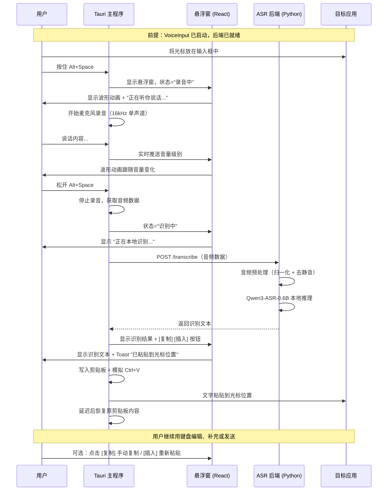
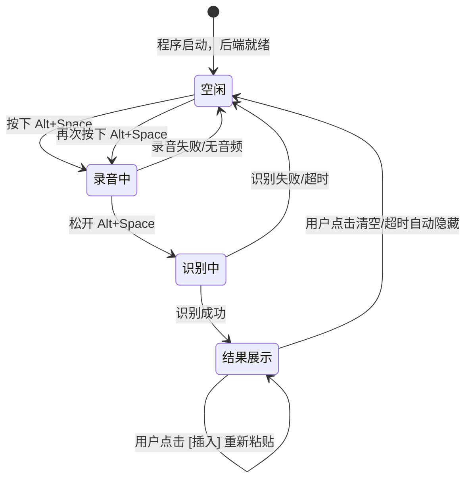
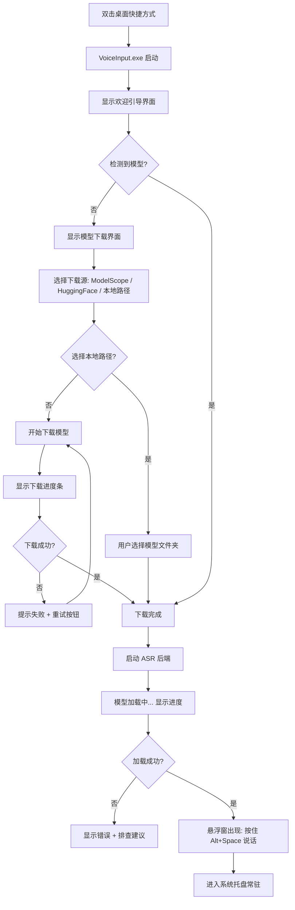

# VoiceInput v2 — 产品需求文档（PRD）

> **版本**：v2.0  
> **日期**：2026-07-09  
> **作者**：许清楚（产品经理）  
> **项目名称**：voice_input_v2  

---

## 项目信息

| 项目 | 内容 |
|------|------|
| 产品名称 | VoiceInput — Windows 本地语音输入法 |
| 一句话描述 | 按住 Alt+Space 说话，松开后文字自动出现在光标位置——完全本地运行，不上传任何数据 |
| 编程语言 | TypeScript（React 前端）+ Rust（Tauri 2 系统层）+ Python（ASR 推理 sidecar） |
| 目标平台 | Windows 10 / Windows 11 |
| 交付形式 | NSIS 安装包 exe（首次运行自动下载模型）+ 预打包 zip（模型内置） |
| 原始需求 | 将已有 PyQt5 原型重构为 Tauri 2 + React 桌面应用，面向普通消费者，双击安装即用，零配置 |

### 原始需求复述

现有原型（`E:\ASK\voice-input\`）基于 PyQt5 实现，已验证核心功能（豆包风格悬浮窗、按住说话、本地识别、自动粘贴、系统托盘、设置面板）。v2 版本需要：

1. 将前端从 PyQt5 迁移到 **Tauri 2 + React + TypeScript**，获得更小的安装体积和更现代的 UI
2. 将后端 ASR 推理封装为 **Python sidecar**（`asr_backend.exe`），随主程序自动启动
3. 打包为 **NSIS 安装包**，普通消费者双击即可安装使用
4. 首次运行自动下载模型或提供预打包版本，**零配置**

---

## 1. 产品目标

| 编号 | 目标 | 说明 |
|------|------|------|
| G1 | **双击安装，即装即用** | 用户下载安装包后双击安装，不需要安装 Python、不需要配置环境变量、不需要手动下载模型——打开就能用 |
| G2 | **说话即打字，像呼吸一样自然** | 按住一个键说话，松开后文字自动出现在光标位置，速度接近正常打字的节奏，让用户忘记"语音输入"这个动作 |
| G3 | **完全本地，隐私无忧** | 所有语音识别在用户电脑上完成，录音和识别结果不上传任何服务器。用户可以放心说任何内容，包括密码、私密信息 |
| G4 | **中英文随意切换，识别准确** | 支持中文、英文和中英混合说话（如"帮我用 Python 写一个 WebSocket 客户端"），不需要手动切换语言模式 |
| G5 | **安静不打扰** | 软件常驻后台，只在用户需要时出现一个小窗口，用完自动消失，不弹广告、不抢焦点、不影响正常工作 |

---

## 2. 目标用户画像

### 画像 A：文字工作者 — 小李

> **身份**：自由撰稿人，每天写大量文章和邮件  
> **痛点**：长时间打字导致手腕酸痛，有时灵感来了打字速度跟不上思维  
> **场景**：在 Word 和浏览器之间切换写稿，希望用说话的方式快速把想法变成文字，说完后再用键盘修改润色  
> **期望**：按住快捷键说一段话，文字直接出现在光标位置，说完继续用键盘编辑。不需要切换到单独的语音输入窗口

### 画像 B：程序员 — 老王

> **身份**：后端开发工程师，经常在 IDE、终端、文档之间切换  
> **痛点**：写技术文档时经常需要输入英文术语和中英混合内容，传统语音输入法对编程术语识别很差  
> **场景**：在 VS Code 里写注释和文档，在 Slack 里回复同事消息，需要快速输入"用 FastAPI 搭建一个 WebSocket 服务"这类内容  
> **期望**：能准确识别技术术语（Python、Tauri、CUDA 等），支持中英混合说话，不需要反复纠正

### 画像 C：普通办公族 — 张阿姨

> **身份**：行政文员，电脑操作不熟练，打字速度慢  
> **痛点**：拼音输入法经常打错字，五笔学不会，遇到长邮件回复要花很长时间  
> **场景**：在微信、QQ、OA 系统里回复消息和填写表单，希望用说话代替打字  
> **期望**：操作越简单越好，不要让我选模型、配参数，按一个键就能说，说完文字就出来了

---

## 3. 需求池

### P0 — 必须做（MVP 核心）

| 编号 | 需求标题 | Why | 验收标准 |
|------|----------|-----|----------|
| P0-01 | **NSIS 安装包** | 普通消费者不会用 Python，必须提供双击即装的安装包 | ① 生成 `VoiceInput-Setup.exe` 安装包 ② 双击安装，无需任何技术操作 ③ 安装后桌面有快捷方式 ④ 支持卸载 |
| P0-02 | **全局快捷键录音** | 用户在任意应用中随时触发语音输入，不能要求切换到特定窗口 | ① 默认快捷键 `Alt+Space` ② 按住开始录音，松开停止 ③ 在记事本、浏览器、微信、Word 中均能触发 ④ 快捷键可自定义 |
| P0-03 | **麦克风录音** | 采集用户语音，是语音输入的基础 | ① 使用系统默认麦克风录音 ② 采样率 16kHz 单声道 ③ 录音时悬浮窗显示波形动画和计时 ④ 最长录音 120 秒自动停止 |
| P0-04 | **本地语音识别** | 将录音转为文字，是产品的核心价值 | ① 使用 Qwen3-ASR-0.6B 本地推理 ② 支持中文识别 ③ 支持英文识别 ④ 支持中英混合识别 ⑤ 松开快捷键后 1-3 秒内返回结果 |
| P0-05 | **自动粘贴到光标位置** | 用户不想手动复制粘贴，希望文字直接出现在光标处 | ① 识别结果自动写入剪贴板 ② 模拟 `Ctrl+V` 粘贴到当前光标位置 ③ 粘贴后延迟 500-1000ms 恢复原剪贴板内容 ④ 粘贴失败时悬浮窗提供 [复制] 按钮 |
| P0-06 | **悬浮窗 GUI 显示** | 用户需要视觉反馈：录音中、识别中、识别结果 | ① 录音时显示"正在听你说话..."+ 波形动画 ② 识别时显示"正在本地识别..." ③ 识别完成显示识别文本 + [复制] [插入] 按钮 ④ 悬浮窗可拖拽移动 ⑤ 白色圆角卡片 + 阴影，豆包风格 |
| P0-07 | **后端 sidecar 自动管理** | 用户不应感知后端服务的存在，主程序自动启动和管理 | ① Tauri 主程序启动时自动检测并启动 `asr_backend.exe` ② 后端绑定 `127.0.0.1`，不暴露到网络 ③ 主程序退出时自动关闭后端 ④ 后端崩溃时自动重启 |
| P0-08 | **首次运行模型下载** | 安装包不内置模型以控制体积，首次运行时下载 | ① 首次启动检测模型是否存在 ② 模型不存在时显示下载引导界面 ③ 支持从 ModelScope 下载（国内优先） ④ 下载进度可见 ⑤ 下载失败可重试 ⑥ 支持手动指定本地模型路径跳过下载 |

### P1 — 应该做（体验完善）

| 编号 | 需求标题 | Why | 验收标准 |
|------|----------|-----|----------|
| P1-01 | **设置面板** | 用户需要自定义快捷键、麦克风、语言等参数 | ① 齿轮图标打开设置 ② 包含以下分组：快捷键 / 麦克风 / 语言 / 音频 / 高级 ③ 设置修改后立即生效并持久化 ④ 四个 Tab 页：麦克风选择+测试、快捷键自定义、音频参数、高级选项 |
| P1-02 | **系统托盘常驻** | 软件应在后台常驻，随时可用，不占用任务栏 | ① 最小化到系统托盘 ② 托盘图标显示运行状态 ③ 右键菜单：显示面板 / 设置 / 退出 ④ 单击托盘图标显示悬浮窗 |
| P1-03 | **术语修正词典** | 语音模型对编程术语识别不准（如"派森"→"Python"），需要后处理修正 | ① 内置常见技术术语词典（Python、PyTorch、Tauri、CUDA、FastAPI 等） ② 识别结果自动应用术语修正 ③ 用户可在设置中添加自定义术语 ④ 修正规则：精确匹配替换 |
| P1-04 | **音频预处理** | 原始录音可能音量不均、含静音段，影响识别准确率 | ① 自动音量归一化（峰值标准化到 -1dBFS） ② 自动去除录音头尾静音段 ③ 静音阈值可配置（默认 -40dB） ④ 可在设置中开关 |
| P1-05 | **长音频分段识别** | 超过 25 秒的音频单次识别可能截断或超时，需要分段处理 | ① 音频超过 25 秒自动在静音处分段 ② 分段识别后合并结果 ③ 分段间保留 1 秒重叠避免断句 ④ 识别结果日志记录分段数 |
| P1-06 | **模型生命周期管理** | 模型常驻显存影响其他 GPU 任务，需要灵活的加载/释放策略 | ① 默认"平衡模式"：首次使用加载，空闲 30 分钟释放 ② 支持"性能优先"：启动即加载常驻 ③ 支持"省显存"：每次识别后释放 ④ 托盘菜单提供手动加载/释放 ⑤ 悬浮窗/设置显示模型状态 |
| P1-07 | **语言切换** | 用户有时需要强制指定语言（如纯英文场景），自动检测不够准确 | ① 悬浮窗语言按钮快速切换：Auto / CN / EN ② 托盘菜单可切换语言 ③ 快捷键 `Alt+L` 切换语言 ④ 设置中可选默认语言 |
| P1-08 | **剪贴板恢复** | 自动粘贴会覆盖用户原有剪贴板内容，需要恢复 | ① 粘贴前保存原剪贴板内容 ② 粘贴后延迟 500-1000ms 恢复 ③ 可在设置中关闭恢复功能 ④ 恢复失败不影响主流程 |
| P1-09 | **错误提示与日志** | 出问题时用户需要知道发生了什么，开发者需要日志排查 | ① 悬浮窗显示友好错误提示（如"麦克风启动失败"、"后端未启动"） ② 日志记录到 `AppData\Local\VoiceInput\logs\` ③ 日志不保存原始音频和识别文本（隐私） ④ 托盘菜单"查看日志"快捷打开 |
| P1-10 | **预打包模型版本** | 部分用户网络不好或企业内网，无法首次运行下载模型 | ① 提供模型内置的 zip 压缩包 ② 解压即可使用，无需联网 ③ 体积较大（约 2-3 GB）但开箱即用 |

### P2 — 未来做（功能扩展）

| 编号 | 需求标题 | Why | 验收标准 |
|------|----------|-----|----------|
| P2-01 | **流式识别预览** | 松键后等待识别结果有延迟感，录音过程中显示实时预览可改善体验 | ① 录音过程中每隔几秒做一次临时识别 ② 悬浮窗实时显示预览文本 ③ 最终以松开后的完整识别为准 ④ 可在设置中开关 |
| P2-02 | **VAD 语音活动检测** | 按住说话模式下，用户可能忘记松开或中途停顿，VAD 可智能检测说话结束 | ① 检测到持续静音 2 秒后自动停止录音 ② 可在设置中开关 ③ 与按住说话模式并存，不冲突 |
| P2-03 | **多语言扩展** | 当前只支持中英文，需要扩展到日韩粤等语言 | ① 支持日语识别 ② 支持韩语识别 ③ 支持粤语识别 ④ 语言列表可在设置中选择 |
| P2-04 | **自动更新** | 用户不会主动检查更新，需要自动推送新版本 | ① 启动时检查更新 ② 有新版本时托盘提示 ③ 用户确认后自动下载安装 ④ 支持跳过此版本 |
| P2-05 | **开机自启** | 用户希望开机后自动运行，随时可用 | ① 设置中可选"开机自启" ② 使用 Windows 注册表或启动文件夹实现 ③ 托盘菜单快捷开关 |
| P2-06 | **标点符号处理** | 模型输出标点可能缺失或不规范，影响阅读 | ① 三种模式可选：原始输出 / 简单标点 / 输入法模式 ② 简单标点：自动补充句号、问号 ③ 输入法模式：适合短文本输入，减少标点 |
| P2-07 | **中英混排格式化** | 中英文之间空格不稳定，影响排版美观 | ① 中文与英文单词之间自动加空格 ② 英文缩写保持大写 ③ 模型名、框架名按词典统一格式化 |

---

## 4. 核心交互流程



### 交互状态机



---

## 5. UI 设计稿描述

### 5.1 悬浮录音窗

**整体风格**：豆包风格白色圆角卡片，带柔和阴影，悬浮在屏幕底部中央，始终置顶但不抢焦点。

**尺寸**：宽 460px，高度自适应（紧凑模式约 195px，展开模式约 250px）

**布局结构（从上到下）**：

```
┌──────────────────────────────────────────────────┐
│  🎤 语音输入  ●            ⚙  Auto  ×            │  ← 标题栏
│                                                  │
│         ▎▍▌▋█▋▌▍▎                                │  ← 波形动画区
│                                                  │
│            按住 Alt + Space 说话                  │  ← 状态提示
│                                                  │
│        [识别结果文本区域 - 可选]                   │  ← 识别完成后显示
│                                                  │
│          [清空]  [复制]  [插入 →]                │  ← 操作按钮 - 识别完成后显示
└──────────────────────────────────────────────────┘
```

**标题栏**：
- 左侧：🎤 图标 + "语音输入" 标题 + 红色录音点（录音时显示）
- 右侧：⚙ 设置按钮 / Auto 语言切换按钮 / × 关闭到托盘按钮

**波形动画区**：
- 9 根柱状波形条，宽度 4px，间距 5px
- 颜色随音量变化：蓝色（低）→ 黄色（中）→ 红色（高）
- 录音时跟随实时音量跳动，空闲时静止
- 柱高 4-38px，基于音量级别平滑过渡

**状态提示区**：
- 空闲："按住 Alt + Space 说话"（灰色）
- 录音中："正在录音..."（红色加粗）
- 识别中："正在本地识别..."（黄色加粗）
- 完成："识别完成"（绿色加粗）
- 错误：友好错误提示（红色）

**识别结果区**（识别完成后显示）：
- 显示识别文本，超过 120 字截断显示
- 文字深灰色，14px

**操作按钮区**（识别完成后显示）：
- [清空]：灰色次要按钮，清除结果回到空闲态
- [复制]：灰色次要按钮，复制识别文本到剪贴板
- [插入 →]：蓝色主要按钮，重新粘贴到光标位置

**Toast 通知**：
- 底部短暂浮现的黑色圆角提示，如"已粘贴到光标位置"、"已复制到剪贴板"
- 自动消失（1.5-2.5 秒）

**交互行为**：
- 悬浮窗可拖拽移动（鼠标按住卡片拖动）
- 拖动时暂停波形动画避免卡顿
- 关闭按钮隐藏到托盘，不退出程序

### 5.2 设置面板

**整体风格**：白色背景的独立窗口，500×540px，四个 Tab 页。

**Tab 1 — 麦克风**：
- 输入设备下拉框 + [刷新] 按钮
- [测试麦克风（2秒）] 按钮 + 测试结果显示
- 提示文字：选择「系统默认」将使用 Windows 设置的默认麦克风

**Tab 2 — 快捷键**：
- 录音快捷键：点击按钮捕获新快捷键（显示"按下新快捷键..."），按 Esc 取消
- 语言切换快捷键：同上
- 提示：点击按钮后按下新的快捷键组合

**Tab 3 — 音频**：
- 采样率下拉框（8000/16000/22050/44100/48000 Hz）
- 音量归一化开关
- 裁剪静音开关
- 静音阈值调节（-100 ~ -10 dB）

**Tab 4 — 高级**：
- 服务器地址输入框
- 粘贴延迟调节（0-2000 ms）
- 恢复剪贴板开关
- 最大录音时长（10-600 秒）
- 请求超时（10-600 秒）

**底部按钮**：[保存] [取消]

### 5.3 系统托盘

**托盘图标**：绿色圆形 + 白色麦克风图标，Tooltip 显示"VoiceInput | Alt+Space 说话"

**右键菜单**：
```
VoiceInput
├─ 显示面板
├─ 设置
├─────────────
├─ Auto / CN / EN（语言切换，单选）
├─────────────
├─ 预加载模型
├─ 释放显存
├─────────────
└─ 退出
```

---

## 6. 安装与首次运行体验

### 6.1 下载安装包

用户从官网或分发渠道下载 `VoiceInput-Setup.exe`（约 200-400 MB，不含模型）。

> 对于网络不好的用户，提供 `VoiceInput-Full.zip` 预打包版本（约 2-3 GB，模型内置），解压即可使用。

### 6.2 安装

1. 双击 `VoiceInput-Setup.exe`
2. NSIS 安装向导引导：
   - 选择安装路径（默认 `C:\Program Files\VoiceInput\`）
   - 选择是否创建桌面快捷方式
   - 选择是否开机自启（默认否）
3. 点击"安装"，等待安装完成（约 30 秒）
4. 点击"完成"，可选立即启动

**安装目录结构**：
```
C:\Program Files\VoiceInput\
├─ VoiceInput.exe          ← Tauri 主程序
├─ backend\
│  ├─ asr_backend.exe      ← Python ASR 后端
│  └─ python_runtime\      ← 内嵌 Python 环境
├─ resources\
│  ├─ icon.ico
│  └─ default_config.json
└─ logs\
```

### 6.3 首次启动



**欢迎引导界面**：
- 简洁的单页向导，告知用户：
  - "VoiceInput 已安装成功"
  - "接下来需要下载语音识别模型（约 1.2 GB），下载后所有识别在本地完成，不需要联网"
  - 隐私说明："你的语音数据不会被上传到任何服务器"
- 下载源选择：
  - **ModelScope（推荐国内用户）**：速度较快
  - **HuggingFace**：国际用户
  - **已有本地模型**：高级用户可选择本地文件夹跳过下载

**下载进度界面**：
- 显示下载速度、已下载大小 / 总大小、预估剩余时间
- 支持暂停/继续
- 下载失败可重试，不会从头开始（支持断点续传）

**模型加载界面**：
- 显示"正在加载语音识别模型..."
- 加载时间约 5-20 秒（视硬件而定）
- 加载完成后悬浮窗自动出现

### 6.4 开始使用

1. 悬浮窗出现在屏幕底部中央，显示"按住 Alt + Space 说话"
2. 用户将光标放在任意输入框中（如浏览器搜索框、微信聊天框、Word 文档）
3. 按住 `Alt + Space`，悬浮窗显示"正在录音..."+ 波形动画
4. 说出内容，如"帮我写一封请假邮件"
5. 松开 `Alt + Space`，悬浮窗显示"正在本地识别..."
6. 1-3 秒后，文字自动出现在光标位置，悬浮窗显示识别结果
7. 用户可继续用键盘修改，或点击 [复制] / [插入] 按钮

### 6.5 后续使用

- 程序常驻系统托盘，关机后不会自动重启（除非设置了开机自启）
- 下次双击快捷方式或单击托盘图标即可使用
- 模型已下载，无需再次下载
- 模型默认"平衡模式"：首次使用加载，空闲 30 分钟自动释放显存

---

## 7. 已确认决策

以下决策已由主理人与产品经理共同确认，作为后续架构设计与开发的依据：

| 编号 | 问题 | 最终决策 | 决策理由 |
|------|------|----------|----------|
| Q1 | 默认快捷键 | **`Alt+V`** | `Alt+Space` 是 Windows 系统快捷键（窗口菜单），按住模式不稳定。`Alt+V` 含义明确（Voice），不易误触，不与输入法切换冲突 |
| Q2 | 录音模式 | **P0 只做"按住说话"，P1 再加"点击模式"** | 降低 P0 复杂度，按住模式是最自然交互 |
| Q3 | 模型下载断点续传 | **使用 SDK 原生能力，不支持则支持失败重试** | `huggingface_hub` / `modelscope` SDK 原生支持断点续传 |
| Q4 | CPU 版本 | **完全不做 CPU 版本** | 只支持 NVIDIA GPU，检测不到 GPU 时明确报错提示。不放入任何优先级 |
| Q5 | 预打包 zip 版本 | **放 P1** | P0 优先保证安装包 + 首次下载流程通畅 |
| Q6 | 本地 token 安全 | **P0 实现** | 首次启动生成随机 token，保存到配置文件，主程序调用时自动携带 |
| Q7 | 悬浮窗默认位置 | **屏幕底部中央，距底部 80px** | 避免遮挡顶部标题栏和菜单，用户可拖拽移动 |
| Q8 | 录音方案 | **用 Rust（Tauri 层）录音** | 更稳定，不依赖浏览器 API，与系统控制层统一 |
| Q9 | 设置面板模型管理 Tab | **P1 加入** | P0 阶段模型管理通过托盘菜单完成 |
| Q10 | 多模型切换 | **P0 固定 0.6B，P2 支持多模型** | 设置面板预留模型选择下拉框但 P0 阶段只有一个选项 |

### 补充：CPU 版本移除说明

基于 Q4 决策，本产品 **完全不支持 CPU 推理**。具体要求：

- 安装时检测 NVIDIA GPU，未检测到时**明确报错并阻止启动**（而非"提示慢"）
- 不提供 CPU 版安装包
- 不在 P2 范围内扩展 CPU 支持
- 首次启动引导界面需明确标注"本软件需要 NVIDIA 独立显卡"

---

## 附录 A：需求优先级矩阵

| 优先级 | 数量 | 范围 | MVP 覆盖 |
|--------|------|------|----------|
| P0 | 8 项 | 安装包 + 录音 + 识别 + 粘贴 + GUI + sidecar + 模型下载 | ✅ 全覆盖 |
| P1 | 10 项 | 设置面板 + 托盘 + 术语修正 + 音频预处理 + 长音频分段 + 模型管理 + 语言切换 + 剪贴板恢复 + 错误日志 + 预打包版本 | ❌ |
| P2 | 7 项 | 流式识别 + VAD + 多语言 + 自动更新 + 开机自启 + 标点处理 + 中英混排 | ❌ |

## 附录 B：与原型（v1）的主要变化

| 维度 | v1 原型 (PyQt5) | v2 (Tauri 2 + React) |
|------|------------------|----------------------|
| 前端框架 | PyQt5 | React + TypeScript |
| 桌面框架 | 无（直接 PyQt5 窗口） | Tauri 2 |
| 后端通信 | HTTP (127.0.0.1:9876) | HTTP (127.0.0.1:8765) + 本地 token |
| 打包方式 | PyInstaller 单 exe | NSIS 安装包 + Python sidecar |
| 模型下载 | 手动设置环境变量 | 首次运行 GUI 引导下载 |
| 快捷键 | pynput | Tauri global-shortcut 插件 |
| 录音 | sounddevice (Python) | Tauri/Rust 或 Web Audio API |
| 粘贴 | ctypes + pyperclip | Tauri clipboard + SendInput |
| 系统托盘 | QSystemTrayIcon | Tauri tray 插件 |
| 安装体验 | 需要安装 Python 环境 | 双击安装包即用 |
| 目标用户 | 开发者 | 普通消费者 |
